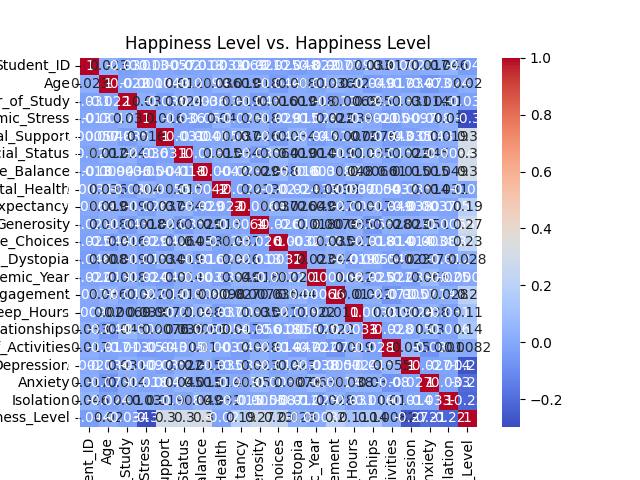

# Student Happiness Analysis

## Overview
This project explores factors influencing student happiness using a real-world dataset. Through exploratory data analysis and visualization, it examines how academic stress, sleep habits, and emotional well-being relate to happiness levels. The goal is to uncover meaningful insights and present them with clarity and precision using Python.

## Objectives
- Analyze the distribution of happiness among students
- Identify correlations between happiness and academic/emotional factors
- Visualize key relationships using Python libraries
- Demonstrate data analysis and storytelling skills for portfolio and internship applications

## Tools & Technologies
- Python 3
- pandas
- NumPy
- Seaborn
- Matplotlib
- PyCharm
- Git & GitHub

## Visualizations

### 1. Happiness Level Distribution
  
A histogram showing how happiness scores are distributed across the student population.

### 2. Academic Stress vs Happiness
  
A scatter plot illustrating the negative relationship between academic stress and happiness.

### 3. Correlation Matrix
  
A heatmap highlighting the strength of relationships between numeric features, including happiness, sleep, stress, and emotional factors.

## Key Insights
- Academic stress negatively correlates with happiness
- Sleep and social support show positive associations with happiness
- Emotional factors such as depression and anxiety significantly impact well-being

## Next Steps
- Extend analysis with predictive modeling (e.g., linear regression)
- Add interactivity using Streamlit or Dash
- Explore subgroup differences (e.g., gender, academic year)

